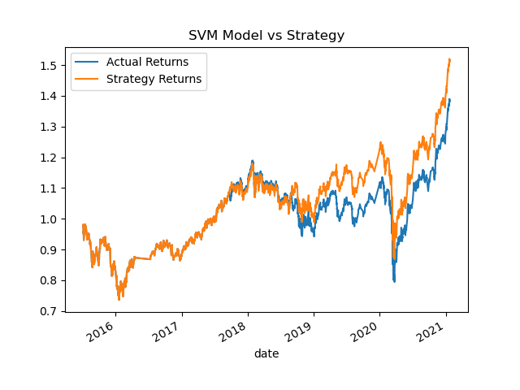
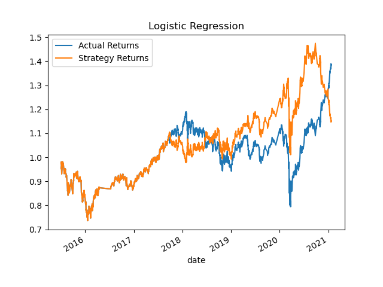

# Module_14_Challenge

14th Challenge for Columbia FinTech Bootcamp

## Technologies 

* pandas
* numpy
* pathlib
* sklearn
* hvplot
* matplotlib

## Evaluation

The baseline trading algorithm shows that the strategy has a greater return when compared to actual.

The logistical regression model outperformed the actual returns in the later years.

